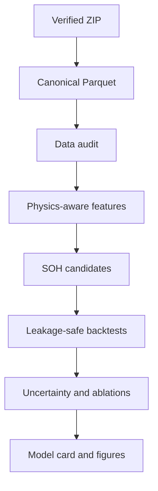

# Architecture and analytical contracts

## System boundary

The repository converts immutable MATLAB tables into assessment-level health trajectories and
then evaluates forecasts. Raw data never enter model code directly.

## Hard contracts

| Layer | Input unit | Output unit | Non-negotiable check |
|---|---|---|---|
| Ingestion | MATLAB table | measurement row | checksum, source identity, schema flag |
| Features | one diagnostic curve | cell-assessment row | no cross-assessment aggregation |
| Targets | performance feature | normalized SOH/RUL | normalize within cell; retain censoring |
| Validation | cell-assessment row | fold predictions | cell isolation and chronological order |
| Evaluation | out-of-fold predictions | metrics/plots | cell- and horizon-level reporting |

The design separates *what happened in one diagnostic measurement* from *how health evolves
across diagnostics*. This prevents `elapsed_s`, which restarts inside each experiment, from being
misused as a lifetime clock.

## Production-minded choices

- Pydantic stores immutable source metadata.
- Pooch verifies content hashes and avoids manual downloads.
- Parquet provides typed, compressed analytical tables.
- Typer exposes reproducible commands.
- YAML records experiment assumptions outside notebooks.
- Pytest, Ruff, Mypy, pre-commit, and GitHub Actions enforce code quality.
- MLflow is available for later experiment tracking; predictions remain exportable CSV files.
